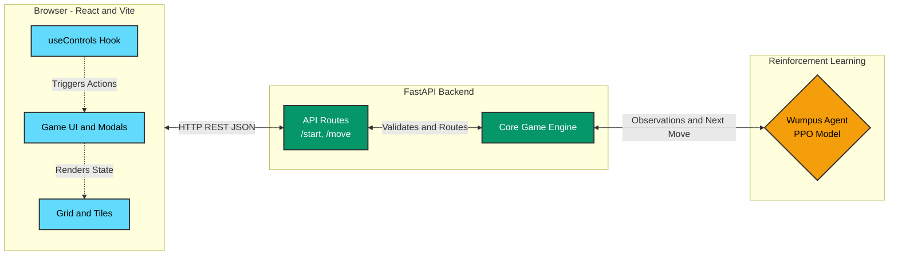

# Hunt the Wumpus

Hunt the Wumpus is a full-stack adversarial dungeon game where the player navigates a 10x10 grid to find gold or eliminate the Wumpus while avoiding lethal hazards. The Wumpus is controlled by a PPO-trained reinforcement learning agent that hunts the player using indirect sensory memory.

## Features

- 10x10 dungeon grid gameplay with exploration and hazards
- Fog of war to hide unexplored tiles
- Sensory hints (Breeze, Stench, Shine) for environmental awareness
- PPO-trained Wumpus AI for adaptive hunting behavior
- One-arrow shoot mechanic in cardinal directions
- Multiple game-over outcomes: won, killed Wumpus, fell in pit, devoured by Wumpus

## Architecture Overview

The frontend React application communicates with a FastAPI backend over REST. The backend orchestrates game state transitions via the engine and uses a PPO-based Wumpus agent for enemy behavior.



## Prerequisites

- Python 3.11+
- Node.js 18+

## Installation & Running

```bash
# Backend
cd backend
python -m venv .venv
# Windows: .venv\Scripts\activate  |  Unix: source .venv/bin/activate
pip install -r requirements.txt
uvicorn api.main:app --reload --port 8000

# Frontend (new terminal)
cd frontend
pnpm install
pnpm dev
```

## Train the Wumpus AI

```bash
cd backend
python -m rl.train --timesteps 1000000
# Model saved to backend/models/hunter_wumpus_model.zip
```

## Game Controls

| Key                        | Action                               |
| -------------------------- | ------------------------------------ |
| `W` / `ArrowUp`            | Move North                           |
| `S` / `ArrowDown`          | Move South                           |
| `D` / `ArrowRight`         | Move East                            |
| `A` / `ArrowLeft`          | Move West                            |
| `Space`                    | Toggle aim mode (if arrow available) |
| Direction key while aiming | Shoot arrow in that direction        |

## Running Tests

```bash
cd backend && python -m pytest tests/ -v
cd frontend && pnpm test
```

## Project Structure

```text
├── backend/
│   ├── api/           FastAPI routes, schemas, main
│   ├── engine/        Core game logic (game_state.py, entities.py, senses.py)
│   ├── rl/            RL environment (env.py), agent (agent.py), train (train.py)
│   ├── models/        Trained PPO model (gitignored)
│   ├── tests/         pytest test suite (35 tests)
│   └── requirements.txt
├── frontend/
│   ├── src/
│   │   ├── api/       gameService.js (HTTP client)
│   │   ├── components/ Grid, Tile, GameUI, GameOverModal, LoadingOverlay
│   │   ├── hooks/     useControls.js (keyboard handling)
│   │   ├── store/     GameContext, gameReducer
│   │   └── styles/    CSS modules
│   ├── package.json
│   └── index.html
├── README.md
└── TECHNICAL_REPORT.md
```
