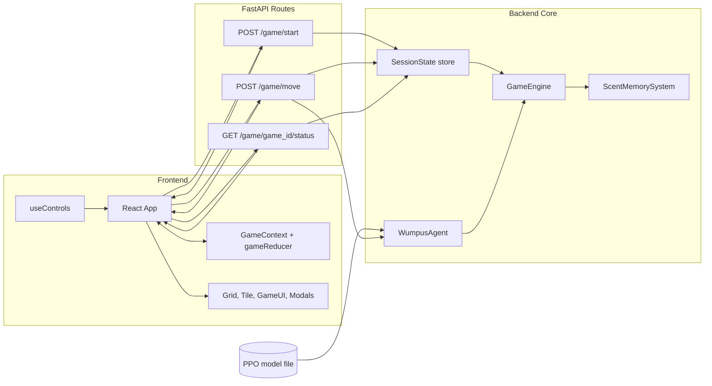
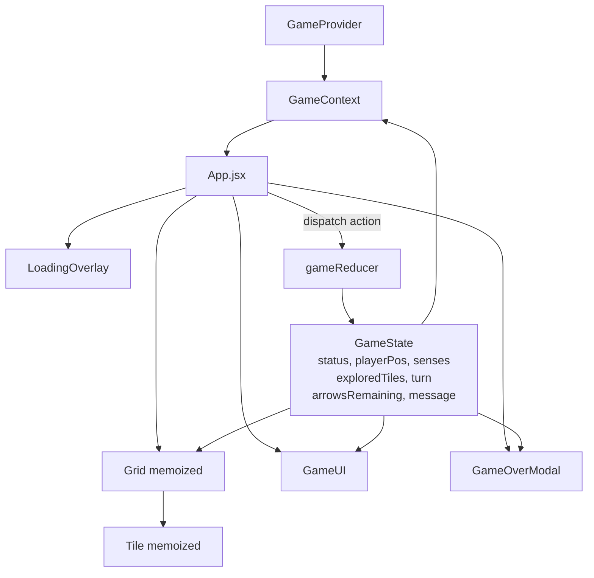
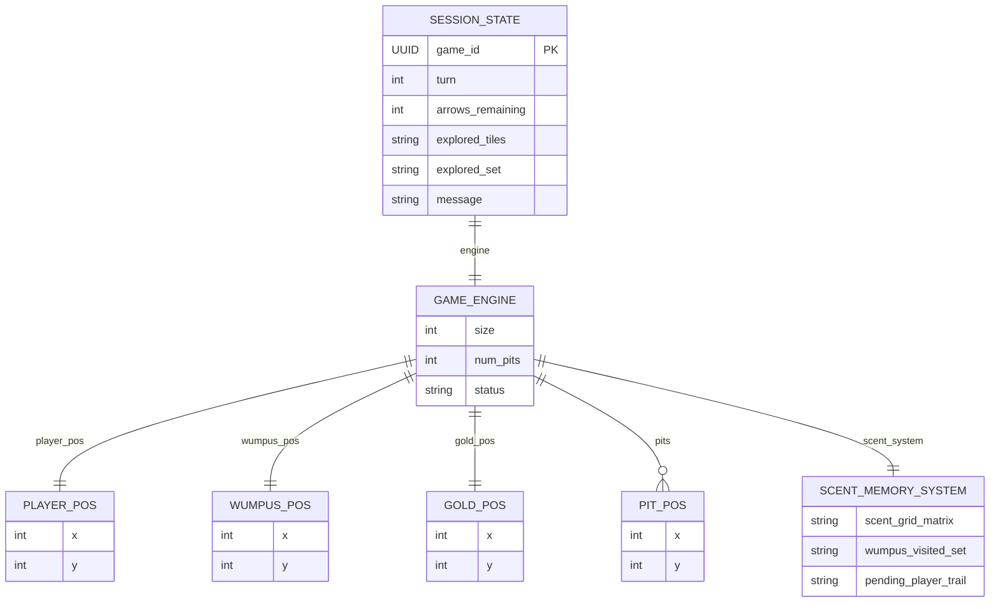
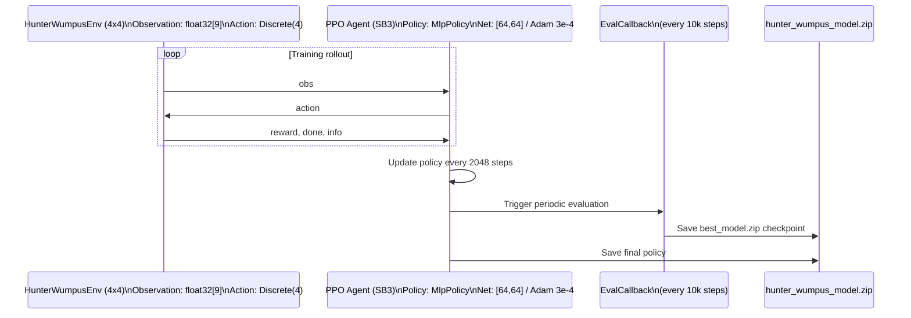

# TECHNICAL REPORT

## 1. Abstract

This project implements a modern full-stack adaptation of the Wumpus World with an intelligent RL-controlled antagonist. A FastAPI backend provides deterministic game mechanics and state transitions, while a React frontend delivers an interactive grid-based experience. The Wumpus behavior is learned using Proximal Policy Optimization (PPO) from Stable-Baselines3, with a scent-memory observation design that encourages realistic pursuit rather than direct position cheating.

## 2. Introduction

The Wumpus World is a classic example of a knowledge-based agent in AI. Where the player explores a hazardous grid to find gold and survive. This project extends the original concept by introducing an intelligent adversary (the Wumpus) trained through reinforcement learning.

Rule-based enemies are predictable and often brittle under stochastic environments. Reinforcement learning was chosen to allow adaptive policy learning from rewards, enabling emergent pursuit strategies without manually encoding all chase behaviors.

The project scope includes:

- A Python/FastAPI backend with complete game engine logic
- A PPO-based Wumpus agent trained in a Gymnasium-compatible environment
- A React + Vite frontend with fog-of-war, controls, and game state rendering
- REST API integration for gameplay actions and session updates

## 3. Game Environment Design

### 3.1 State Space

The Wumpus agent observes a 9-dimensional continuous float32 vector:

| Index | Feature                            | Description                        | Range  |
| ----- | ---------------------------------- | ---------------------------------- | ------ |
| 0     | wumpus_x / (grid_size-1)           | Wumpus normalized x position       | [0, 1] |
| 1     | wumpus_y / (grid_size-1)           | Wumpus normalized y position       | [0, 1] |
| 2     | player_x / (grid_size-1)           | Player normalized x position       | [0, 1] |
| 3     | player_y / (grid_size-1)           | Player normalized y position       | [0, 1] |
| 4     | scent[wumpus] / MAX_SCENT          | Scent at Wumpus's current position | [0, 1] |
| 5     | scent[north of wumpus] / MAX_SCENT | Scent signal north                 | [0, 1] |
| 6     | scent[east of wumpus] / MAX_SCENT  | Scent signal east                  | [0, 1] |
| 7     | scent[south of wumpus] / MAX_SCENT | Scent signal south                 | [0, 1] |
| 8     | scent[west of wumpus] / MAX_SCENT  | Scent signal west                  | [0, 1] |

MAX_SCENT = 3 (scent decays each step).

### 3.2 Scent Trail Memory System

The player leaves a scent trail in previously occupied cells. This scent value decays over time (maximum persistence of 3 steps). By observing local scent gradients, the Wumpus policy learns tracking behavior that reflects short-term player movement memory, resulting in emergent hunting patterns.

### 3.3 Action Space

The action space is discrete with 4 actions:

- NORTH (0)
- SOUTH (1)
- EAST (2)
- WEST (3)

Each action attempts to move the Wumpus by one cell in the selected direction.

### 3.4 Reward Function

```python
reward = -1.0           # Step penalty: encourages efficiency

if wumpus_before == wumpus_after:
    reward -= 5.0       # Penalty for staying still / hitting wall

if scent_at_new_pos > 0.0:
    reward += 2.0       # Reward for moving on scented trail (tracking player)

if status == "PlayerLost_Wumpus":
    reward += 100.0     # Terminal reward: Wumpus catches player (win)
elif status == "PlayerLost_Pit":
    reward += 50.0      # Reward: player falls in pit (Wumpus survives, player dead)
elif status == "PlayerWon":
    reward -= 100.0     # Penalty: player escaped with gold (Wumpus failed)
```

Reward summary:

| Event                      | Reward Impact   |
| -------------------------- | --------------- |
| Per-step movement          | -1.0            |
| Invalid move / no movement | -5.0 additional |
| Moving onto scented tile   | +2.0            |
| Player caught by Wumpus    | +100.0          |
| Player dies in pit         | +50.0           |
| Player wins (gold escape)  | -100.0          |

### 3.5 Episode Dynamics

- Each episode starts from a random board on a 4x4 grid with 3 pits
- Maximum episode length is 200 steps (truncation)
- During training, the player executes random cardinal moves
- The Wumpus is the only learning agent

## 4. RL Algorithm — Proximal Policy Optimization (PPO)

PPO was selected for stable and sample-efficient on-policy learning, strong baseline performance, and robust behavior with low-dimensional continuous observations.

The clipped PPO objective is:

$$
L^{CLIP}(\theta) = \mathbb{E}_t\left[\min\left(r_t(\theta)\hat{A}_t, \text{clip}(r_t(\theta), 1-\epsilon, 1+\epsilon)\hat{A}_t\right)\right]
$$

where:

$$
r_t(\theta) = \frac{\pi_\theta(a_t|s_t)}{\pi_{\theta_{old}}(a_t|s_t)}
$$

The clipping term limits update magnitude and reduces policy collapse risk, typically with $\epsilon \approx 0.2$. PPO in SB3 also optimizes a value-loss term and entropy bonus, while advantages are estimated via Generalized Advantage Estimation (GAE).

Training hyperparameters (SB3 defaults used):

| Parameter       | Value     | Description            |
| --------------- | --------- | ---------------------- |
| n_steps         | 2048      | Steps before update    |
| batch_size      | 64        | Mini-batch size        |
| n_epochs        | 10        | Gradient update epochs |
| gamma           | 0.99      | Discount factor        |
| learning_rate   | 3e-4      | Adam optimizer LR      |
| clip_range      | 0.2       | PPO clip epsilon       |
| total_timesteps | 1,000,000 | Training length        |

## 5. System Architecture

### 5.1 Overall Architecture ASCII Diagram



### 5.2 Component Relationships Diagram (UML-style ASCII)



### 5.3 Entity Relationship Diagram (ERD — ASCII)



### 5.4 Training Pipeline Diagram



## 6. Sensory and Memory System

- Breeze, Stench, and Shine are computed from orthogonal neighboring tiles to represent local hazard and objective proximity.
- The scent memory uses `MAX_SCENT = 3` and applies per-step decay to all scent cells.
- The player deposits scent on previous positions, creating short-lived trajectories.
- This indirect signal design prevents trivial pursuit from direct player coordinates and forces learned tracking behavior.

Decay rule:

$$
\text{scent}[x][y] = \max(0, \text{scent}[x][y] - 1)
$$

## 7. Software Architecture Decisions

- **FastAPI + Pydantic**: lightweight REST implementation with typed request/response validation.
- **In-memory session store (`dict`)**: acceptable for single-user local execution; production should migrate to Redis or a database.
- **React Context + `useReducer`**: simpler than full Redux while preserving predictable state transitions.
- **`React.memo` on Grid/Tile**: reduces unnecessary large-grid render costs.
- **Separation of concerns**: `engine/`, `rl/`, and `api/` are modular and independently testable.

## 8. Results & Evaluation

- Model training runs for 1,000,000 timesteps on a 4x4 environment with 3 pits.
- `EvalCallback` evaluates every 10,000 timesteps and retains the best-performing checkpoint.
- Reward shaping biases the policy toward active pursuit and successful terminal outcomes.
- Inference uses `deterministic=True` in `PPO.predict()` to ensure consistent gameplay behavior.

## 9. Limitations & Future Work

- Training occurs on a 4x4 grid, while deployment is on 10x10; normalized state helps transfer, but policy quality may degrade.
- Support for multiple Wumpus entities can extend challenge and complexity.
- A trainable player policy can enable adversarial or self-play setups.
- WebSocket-based updates can reduce request overhead and improve interactivity.
- Persistent sessions with database-backed storage can enable multi-user and resume functionality.

## 10. Conclusion

The project demonstrates an end-to-end adversarial game system where a reinforcement-learned Wumpus agent operates within a deterministic game engine served over REST and visualized through a responsive React frontend. The scent-memory observation strategy and reward shaping produce practical hunting behavior while maintaining game fairness and extensibility for future AI/ML enhancements.
